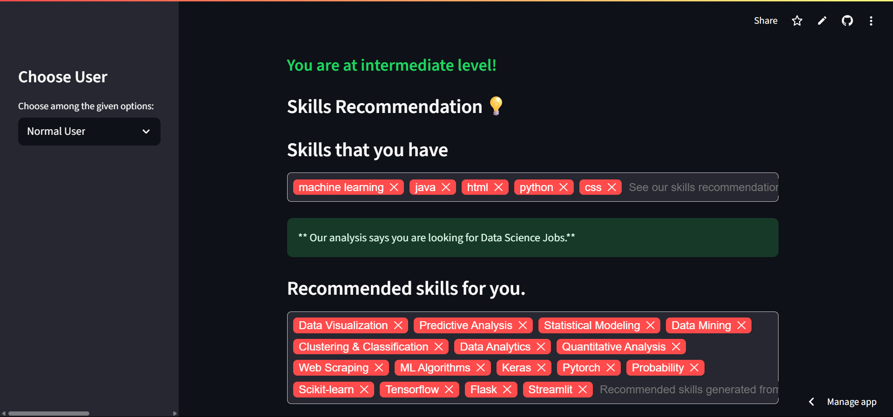
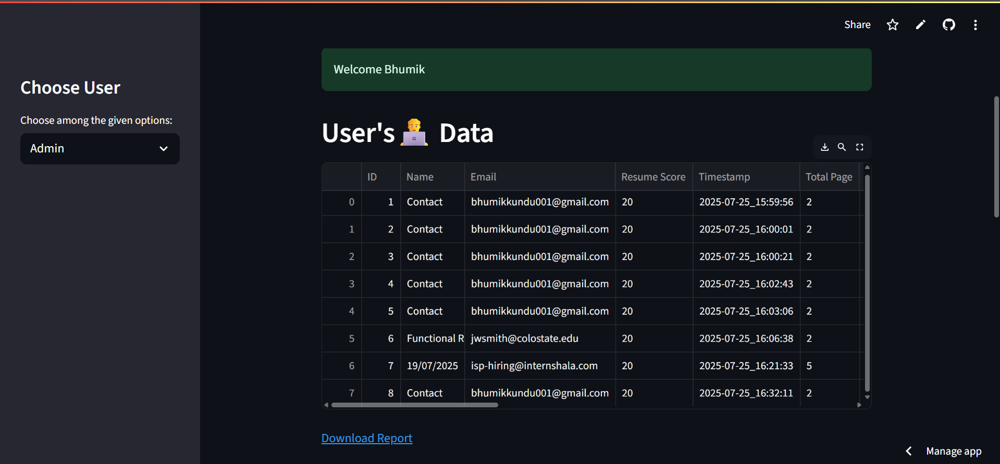

---

## 🧠 Smart Resume Analyzer

A Streamlit-powered AI Resume Analyzer that reads resumes (PDF), extracts key details, identifies skill gaps, and recommends personalized learning resources — all in seconds. Built for students, job seekers, and recruiters.

---

### 📌 Features

* 📄 Upload and analyze PDF resumes instantly
* 🧠 NLP-based skill extraction using `nltk` & `pdfminer`
* 🎯 Candidate level prediction (Fresher, Intermediate, Experienced)
* 💡 Personalized skill + course recommendations
* 📊 Admin dashboard with live data insights (Pie charts using Plotly)
* 🎥 Bonus: Resume & Interview Tips via YouTube

---

### 🚀 Tech Stack

| Layer          | Technology Used                         |
| -------------- | --------------------------------------- |
| 🧠 NLP/Parsing | `pdfminer`, `nltk`, `re`, `spaCy`       |
| 💻 Frontend    | `Streamlit`, `streamlit-tags`, `plotly` |
| 🛢️ Database   | `Supabase (PostgreSQL)`                 |
| 🔗 Extras      | `yt-dlp` for YouTube scraping           |

---

### 🔗 Live App

▶️ **Try it now** → [https://resume-analyzer001.streamlit.app/](https://resume-analyzer001.streamlit.app/)

---

### 🧪 How to Run Locally

1. **Clone this repository**

```bash
git clone https://github.com/your-username/resume-analyzer.git
cd resume-analyzer
```

2. **Install dependencies**

```bash
pip install -r requirements.txt
```

3. **Add your Supabase credentials**

Create a file at `.streamlit/secrets.toml`:

```toml
[db]
host = "your-db-host"
port = "5432"
database = "your-database-name"
user = "your-username"
password = "your-password"
```

4. **Run the app**

```bash
streamlit run App.py
```

---

### 👨‍💼 Admin Dashboard Access

Use the following login:

```
Username: admin_bhumik
Password: 198200
```

---

### 📸 Sample Screenshots

#### Resume Upload & Analysis



#### Admin Dashboard Pie Charts



---

### 🎯 Problem Solved

Manual resume screening is time-consuming and subjective. This tool uses automation to:

* Extract resume data
* Recommend skills and courses
* Provide admin insights for better decision-making

---

### 👨‍💻 Developer

| Name         | Role                      |
| ------------ | ------------------------- |
| Bhumik Kundu | Full-stack & ML Developer |

---

### 📜 License

This project is licensed under the [MIT License](LICENSE).

---
